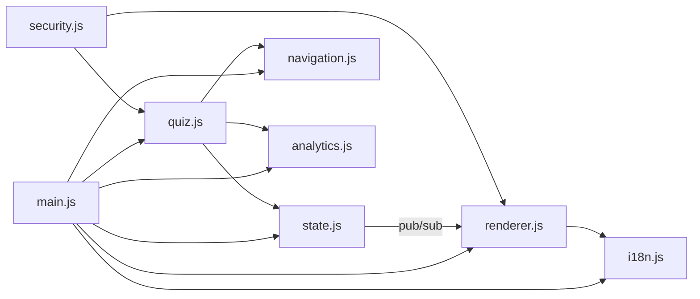

# 🗳️ Election Navigator

> **A non-partisan, interactive educational tool that guides users through the election process — from registration to results.**


[](#)
[](#)
[](#)
[](#)
[](#)

---

## 🎯 Overview

Election Navigator is a **production-grade, zero-dependency** web application that demystifies the election process for citizens worldwide. Built with a unique **"Neon Grid Protocol"** aesthetic, it combines terminal-inspired design with modern accessibility standards.

### Key Features

- 🌐 **5 Languages** — English, Hindi, Tamil, Telugu, Bengali (dynamic i18n)
- 🧠 **Interactive Quizzes** — Phase-by-phase knowledge assessments with instant feedback
- 📅 **Region-Specific Timelines** — Tailored election timelines for US, India, and UK
- 🔒 **Security Hardened** — CSP, Trusted Types, SRI, input sanitization, XSS prevention
- ♿ **WCAG 2.1 AA Compliant** — Focus trapping, ARIA roles, skip navigation, forced-colors support
- 📊 **GA4 Analytics** — Privacy-respecting with DNT support
- 📱 **PWA-Ready** — Service worker, manifest.json, offline-first caching
- 🧪 **80+ Automated Tests** — 9 test suites covering all modules

---

## 🏗️ Architecture

```
election-navigator/
├── index.html              # Entry point — semantic HTML5, ARIA, JSON-LD
├── manifest.json           # PWA manifest
├── sw.js                   # Service Worker — cache-first strategy
├── robots.txt              # SEO crawl directives
├── sitemap.xml             # Sitemap with hreflang alternates
├── css/
│   ├── tokens.css          # Design tokens & CSS custom properties
│   ├── base.css            # Reset, a11y utilities, reduced-motion, forced-colors
│   ├── layout.css          # Header, hero, grid, timeline, responsive
│   ├── components.css      # Cards, modals, buttons, quiz, celebration
│   └── neon-grid.css       # Terminal UI elements & neon aesthetic
├── js/
│   ├── main.js             # Entry point — SW registration, event wiring
│   ├── state.js            # Centralized state with pub/sub event bus
│   ├── renderer.js         # DOM rendering — DocumentFragment, i18n
│   ├── navigation.js       # Scroll, modals, focus trap, ARIA announcements
│   ├── quiz.js             # Quiz engine — scoring, validation, assertive a11y
│   ├── security.js         # Trusted Types, sanitization, escaping
│   ├── i18n.js             # Language manager — reactive, localStorage
│   ├── analytics.js        # GA4 event tracking — privacy-first
│   └── gtag.js             # Externalized GA4 initialization (CSP-safe)
├── data/
│   ├── phases.js           # Election phase content (immutable)
│   ├── quizzes.js          # Quiz questions with explanations (immutable)
│   ├── timelines.js        # Region-specific timelines (immutable)
│   └── i18n.js             # Translation strings — 5 languages (immutable)
├── tests/
│   ├── index.html          # Test dashboard (80+ assertions)
│   ├── test-runner.js      # Zero-dependency test framework
│   ├── state.test.js       # State management tests
│   ├── security.test.js    # XSS prevention & sanitization tests
│   ├── data.test.js        # Data integrity & immutability tests
│   ├── accessibility.test.js  # WCAG compliance tests
│   ├── navigation.test.js  # Modal, focus trap, keyboard tests
│   ├── quiz.test.js        # Quiz logic & scoring tests
│   ├── i18n.test.js        # Translation completeness tests
│   ├── renderer.test.js    # DOM rendering validation tests
│   └── analytics.test.js   # Privacy & GA4 integration tests
├── Dockerfile              # Multi-stage nginx:alpine build
├── cloudbuild.yaml         # GCP Cloud Build → Artifact Registry → Cloud Run
├── nginx.conf              # Security headers, gzip, caching
└── .eslintrc.json          # Strict linting rules
```

### Module Communication Flow



---

## 🔒 Security Architecture

| Layer | Implementation |
|-------|---------------|
| **CSP** | Strict Content-Security-Policy with no `'unsafe-inline'` |
| **Trusted Types** | DOM-based XSS prevention policy for innerHTML sinks |
| **Input Sanitization** | Multi-layer: tag stripping, char filtering, length limits |
| **HTML Sanitizer** | DOMParser-based with tag/attribute whitelist |
| **SRI** | Subresource integrity on external resources |
| **Headers** | HSTS, X-Frame-Options, COEP, COOP, CORP, Permissions-Policy |
| **Data Immutability** | `Object.freeze()` on all exported data structures |
| **Analytics Privacy** | DNT respect, anonymized IP, no PII collection |

---

## ♿ Accessibility

- **Skip Navigation** — Keyboard users bypass header directly to content
- **Focus Trapping** — Modals trap Tab focus; Escape key closes
- **Screen Reader** — Dual aria-live regions (polite + assertive)
- **Heading Hierarchy** — Proper `h1 → h2` structure
- **Semantic HTML** — No redundant ARIA roles on landmark elements
- **High Contrast** — `prefers-contrast: more` support
- **Forced Colors** — Windows High Contrast mode compatible
- **Reduced Motion** — `prefers-reduced-motion` disables animations
- **Button Labels** — Every interactive element has an accessible name
- **Quiz Feedback** — `aria-live="assertive"` interrupts for quiz corrections

---

## 🚀 Deployment

### One-Command Deploy (Google Cloud Run)

```bash
gcloud run deploy election-navigator \
  --source . \
  --region asia-south1 \
  --allow-unauthenticated \
  --port 8080
```

### CI/CD Pipeline

The `cloudbuild.yaml` configures automated deployment:

1. **Build** → Docker image via `nginx:alpine`
2. **Push** → Google Artifact Registry (not deprecated `gcr.io`)
3. **Deploy** → Cloud Run with 128Mi memory, auto-scaling 0-3 instances

---

## 🧪 Testing

Run the test suite by opening `/tests/index.html` in a browser:

```
9 Test Suites • 80+ Assertions
├── State Management    — 9 tests
├── Security            — 14 tests
├── Data Integrity      — 11 tests
├── Accessibility       — 15 tests
├── Navigation          — 11 tests
├── Quiz Logic          — 15 tests
├── i18n                — 12 tests
├── Renderer            — 10 tests
└── Analytics           — 8 tests
```

---

## 🌐 Supported Languages

| Code | Language | Script |
|------|----------|--------|
| `en` | English  | Latin  |
| `hi` | हिन्दी    | Devanagari |
| `ta` | தமிழ்     | Tamil  |
| `te` | తెలుగు    | Telugu |
| `bn` | বাংলা     | Bengali |

---

## 🛠️ Tech Stack

- **Frontend**: Vanilla JavaScript (ES2020 Modules), HTML5, CSS3
- **Server**: Nginx Alpine
- **Container**: Docker
- **CI/CD**: Google Cloud Build
- **Hosting**: Google Cloud Run
- **Analytics**: Google Analytics 4
- **SEO**: JSON-LD, Open Graph, Twitter Cards, Sitemap, Robots.txt

---

## 👤 Author

**Kanishk Yadav**

---

## 📄 License

This project is for educational purposes. Non-partisan election education.
